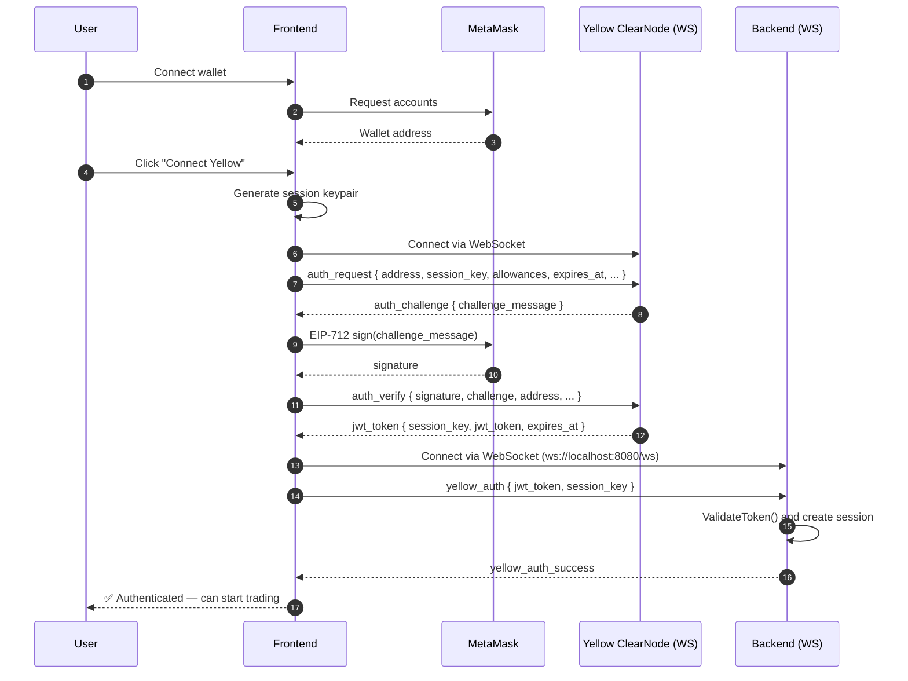

# OrderbookTrade-Yellow

> **CLOB matching engine on Yellow — 0 gas order matching via Nitrolite state channels, on-chain settlement.**

[](https://ethglobal.com/events/hackmoney2026)
[](https://yellow.org)
[](https://www.youtube.com/watch?v=oYwGaJkwgOE)
[](https://ethglobal.com/showcase/orderbooktradeyellow-b7xid)


## 1. What is OrderbookTrade-Yellow?

**OrderbookTrade-Yellow** is a real-time **prediction market** with a  **CLOB orderbook**, powered entirely by Yellow Network's Nitrolite state channels.

* **Key Innovation:** 

  Users deposit once, trade unlimited times with **zero gas fees**, and settle on-chain when they're done.
  

---

## 2. Project Architecture

## 3. Problem Solving 

| AMM Based DEX        | OrderbookTrade-Yellow                      |
| -------------------- | ------------------------------------------ |
| Gas fee per trade    | **Zero gas** during session                |
| 12+ sec confirmation | **< 1 second** execution (Clearnode based) |
| Limited order types  | **CLOB** Full orderbook (limit/market)     |
| Single trade = 1 tx  | **Unlimited trades** = 1 tx                |


## 4.Trading Flow





---

## 5.  Yellow SDK Integration


## 5.1 Session-Based Authentication

```typescript
// EIP-712 signature for session creation
const signer = createEIP712AuthMessageSigner(walletClient, authParams, { name: 'Test app' });
const verifyMsg = await createAuthVerifyMessageFromChallenge(signer, challenge);
```


### 5.2. Off-Chain Order Matching

```go
// Every matched trade updates the state channel
func (s *Server) updateYellowSession(ctx context.Context, marketID string) {
    session.UpdateState(ctx, allocations, appData)
}
```

### 5.3  State Channel Updates

- All trades update off-chain state via Yellow WebSocket
- Signed state includes: version, allocations, app data
- Settlement happens on-chain when user closes session
  

---


##  6. Project Structure

```
orderbooktrade-yellow/
│
├── orderbook-frontend/           # Next.js 16 + React + TypeScript
│   ├── app/                      # Next.js App Router
│   ├── hooks/
│   ├── components/
│   └── lib/
│
├── orderbook-backend/            # Go CLOB Matching Engine
│   ├── cmd/server/
│   └── internal/
│       ├── engine/               # FIFO price-time priority matching
│       ├── yellow/               # Yellow SDK client & session manager
│       ├── api/                  # WebSocket & REST handlers
│       ├── market/               # Prediction market management
│       └── config/               # Environment configuration
│
├── yellow-client/                # SDK Testing & Utilities
│
├── contracts/                    # Solidity Smart Contracts
│   └── (Nitrolite adjudicator contracts)
│
├── assets/                       # Documentation assets
│   ├── logo/
│   ├── screenshot/
│
└── docs/                         # Additional documentation
    ├── YELLOW_SDK.md             # Yellow integration guide
    ├── API.md                    # API documentation
    
    
```


---

## 7.Tech Stack

| Layer | Technology |
|-------|------------|
| Frontend | Next.js 16, React, TypeScript, viem |
| Backend | Go, WebSocket, FIFO Matching Engine |
| Yellow SDK | @erc7824/nitrolite, EIP-712, State Channels |
| Blockchain | EVM-compatible, Sepolia testnet |


---

## 8. Links

- [Demo Video](https://www.youtube.com/watch?v=oYwGaJkwgOE)
- [ETHGlobal Showcase](https://ethglobal.com/showcase/orderbooktradeyellow-b7xid)
- [Repo Link](https://github.com/OrderBookTrade/orderbooktrade-yellow)
- [Demo Website](https://orderbooktrade-yellow-app.vercel.app/)
- [Yellow Network](https://yellow.org)
- [Nitrolite Protocol](https://github.com/erc7824/nitrolite)


