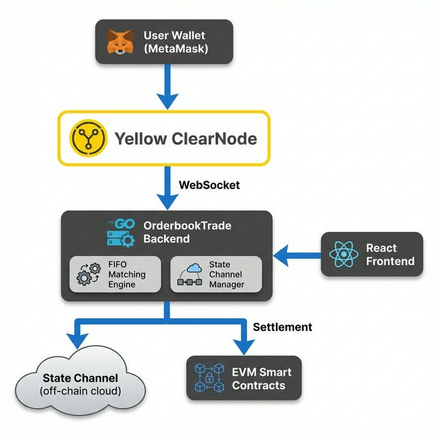
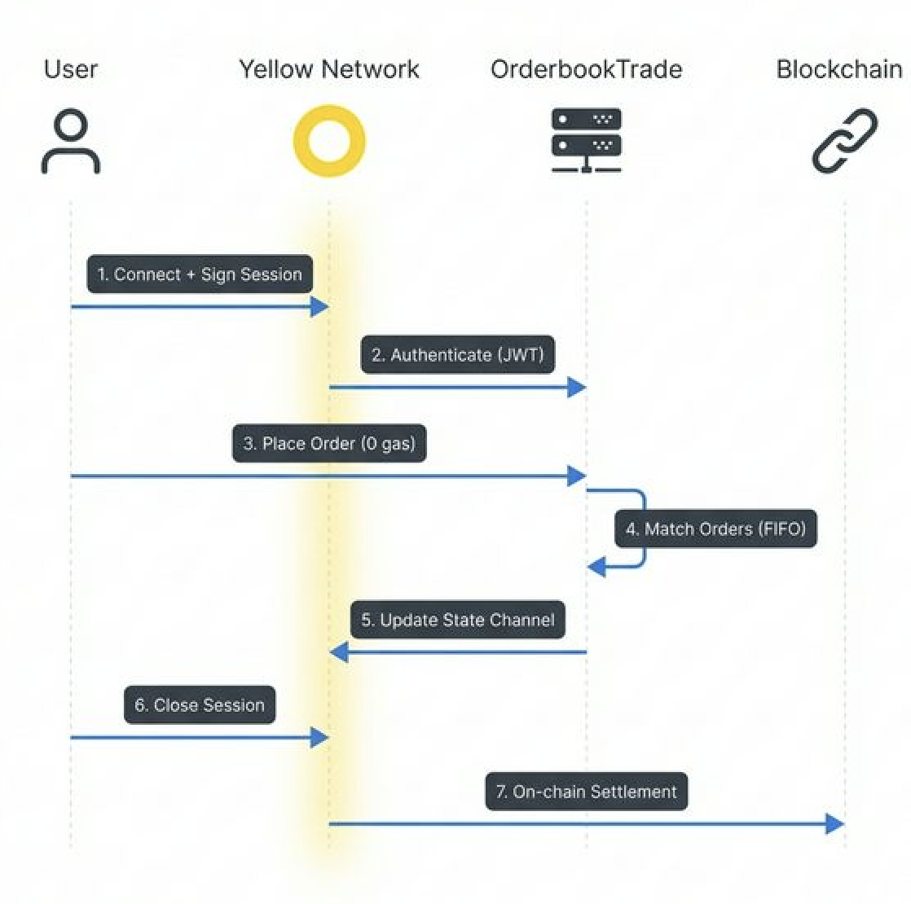

# OrderbookTrade-Yellow

> **CLOB matching engine on Yellow — 0 gas order matching via Nitrolite state channels, on-chain settlement.**

[](https://ethglobal.com/events/hackmoney2026)
[](https://yellow.org)

## 🎯 What is OrderbookTrade-Yellow?

**OrderbookTrade-Yellow** is a real-time **prediction market** with a professional-grade **limit orderbook**, powered entirely by Yellow Network's state channels.

**Key Innovation:** Users deposit once, trade unlimited times with **zero gas fees**, and settle on-chain when they're done.

### Why This Matters

| Traditional DEX | OrderbookTrade-Yellow |
|----------------|----------------------|
| Gas fee per trade | ✅ Zero gas during session |
| 12+ sec confirmation | ⚡ Sub-second execution |
| Limited order types | 📊 Full orderbook (limit/market) |
| Single trade = 1 tx | 🔄 Unlimited trades = 1 tx |

---

## 🏗️ Architecture



### Trading Flow



---

## 🔧 Yellow SDK Integration

### 1. Session-Based Authentication

```typescript
// EIP-712 signature for session creation
const signer = createEIP712AuthMessageSigner(walletClient, authParams, { name: 'Test app' });
const verifyMsg = await createAuthVerifyMessageFromChallenge(signer, challenge);
```

### 2. Off-Chain Order Matching

```go
// Every matched trade updates the state channel
func (s *Server) updateYellowSession(ctx context.Context, marketID string) {
    session.UpdateState(ctx, allocations, appData)
}
```

### 3. State Channel Updates

- All trades update off-chain state via Yellow WebSocket
- Signed state includes: version, allocations, app data
- Settlement happens on-chain when user closes session

---

## 📁 Project Structure

```
orderbooktrade-yellow/
├── orderbook-frontend/     # Next.js 16 + React
│   ├── hooks/
│   │   ├── useYellowAuth.ts   # Yellow SDK auth
│   │   ├── useWebSocket.ts    # Real-time orderbook
│   │   └── useWallet.ts       # MetaMask integration
│   └── components/            # Trading UI
├── orderbook-backend/      # Go matching engine
│   ├── internal/
│   │   ├── engine/           # FIFO orderbook
│   │   ├── yellow/           # Yellow SDK client
│   │   └── api/              # WebSocket handlers
│   └── cmd/server/           # Entry point
├── contracts/              # Solidity (settlement)
└── yellow-client/          # SDK test scripts
```

---

## 🚀 Quick Start

### Prerequisites
- Node.js 18+
- Go 1.21+
- MetaMask wallet

### 1. Backend

```bash
cd orderbook-backend
cp .env.example .env  # Add your PRIVATE_KEY
go run cmd/server/main.go
```

### 2. Frontend

```bash
cd orderbook-frontend
npm install
npm run dev
```

### 3. Open http://localhost:3000

1. Connect MetaMask → Sepolia testnet
2. Click "Connect Yellow" → Sign EIP-712 message
3. Create demo market → Place orders → Trade!

---

## 🛠️ Tech Stack

| Layer | Technology |
|-------|------------|
| Frontend | Next.js 16, React, TypeScript, viem |
| Backend | Go, WebSocket, FIFO Matching Engine |
| Yellow SDK | @erc7824/nitrolite, EIP-712, State Channels |
| Blockchain | EVM-compatible, Sepolia testnet |

---

## 📊 Key Features

- **Zero-gas trading**: Unlimited off-chain trades within session
- **Real-time orderbook**: WebSocket-powered live updates
- **Price-time priority**: Professional FIFO matching algorithm
- **Prediction markets**: YES/NO token pairs with constraint (YES + NO = 1 USDC)
- **Trustless settlement**: On-chain finalization via Nitrolite protocol

---

## 🔗 Links

- [Demo](https://orderbooktrade-yellow-app.vercel.app/)
- [Yellow Network](https://yellow.org)
- [Nitrolite Protocol](https://github.com/erc7824/nitrolite)

---

## 📄 License

MIT
