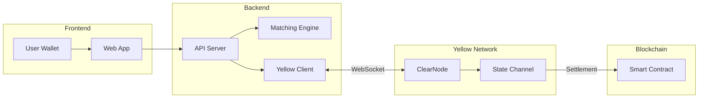
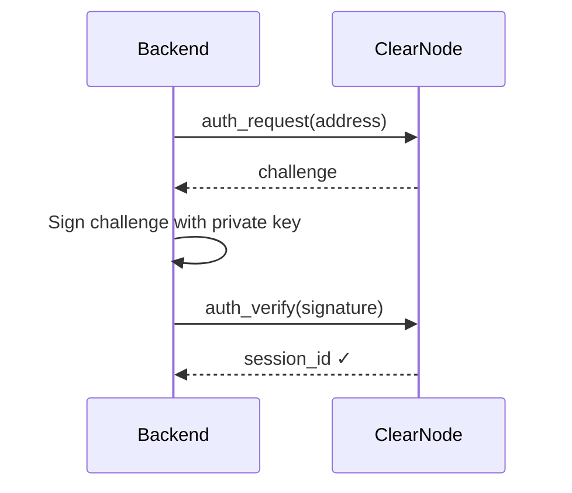

# Yellow SDK Integration Walkthrough

## Overview

The prediction market integrates with **Yellow Network** via the [ClearNode](wss://clearnet.yellow.com/ws) to enable:
- **Gas-free order execution** (off-chain state channels)
- **Cryptographic signing** (EIP-712 for state updates)
- **Final settlement** (on-chain when session closes)

---

## Architecture



---

## Components

### 1. Signer ([signer.go](file:///Users/baice/auditor/projects/orderbook/hackathon/yellow/orderbooktrade-yellow/orderbook-backend/internal/yellow/signer.go))

Handles cryptographic operations:

| Method | Purpose |
|--------|---------|
| `NewSigner(hexKey)` | Create from private key |
| `SignMessage()` | EIP-191 personal sign |
| `SignStateHash()` | EIP-712 state channel signature |
| `VerifySignature()` | Verify recovered address |

### 2. Client ([client.go](file:///Users/baice/auditor/projects/orderbook/hackathon/yellow/orderbooktrade-yellow/orderbook-backend/internal/yellow/client.go))

WebSocket connection to ClearNode:

| Method | Purpose |
|--------|---------|
| `Connect()` | Establish WebSocket |
| `Authenticate()` | Challenge-response auth |
| `SendRequest()` | JSON-RPC with response matching |
| `Ping()` | Keep-alive |

### 3. SessionManager ([session.go](file:///Users/baice/auditor/projects/orderbook/hackathon/yellow/orderbooktrade-yellow/orderbook-backend/internal/yellow/session.go))

Manages state channel sessions:

| Method | Purpose |
|--------|---------|
| `CreateSession()` | Open new channel |
| `UpdateState()` | Submit allocation changes |
| `CloseSession()` | Final settlement |

---

## Authentication Flow



**Code path**: [main.go L41-64](file:///Users/baice/auditor/projects/orderbook/hackathon/yellow/orderbooktrade-yellow/orderbook-backend/cmd/server/main.go#L41-L64)

---

## Session Lifecycle

### Create Session
```go
session, err := sessions.CreateSession(ctx, 
    []string{broker, user},      // participants
    []Allocation{{...}, {...}},  // initial allocations
    adjudicatorAddr,             // contract address
)
```

### Update State (After Trade)
```go
err := session.UpdateState(ctx, 
    newAllocations,  // updated balances
    appData,         // orderbook snapshot JSON
)
```

### Close Session (Settlement)
```go
err := sessions.CloseSession(ctx, channelID)
// Triggers on-chain settlement
```

---

## Environment Variables

| Variable | Description | Example |
|----------|-------------|---------|
| `PRIVATE_KEY` | Broker wallet key | `0xabc123...` |
| `YELLOW_NODE_URL` | ClearNode endpoint | `wss://clearnet.yellow.com/ws` |

---

## Current Status

| Feature | Status |
|---------|--------|
| Signer (EIP-712) | ✅ Implemented |
| Client (WebSocket) | ✅ Implemented |
| SessionManager | ✅ Implemented |
| Trade → StateUpdate | ⚠️ Not wired |
| Settlement | ⚠️ Not wired |

---

## Next Steps

1. **Set `PRIVATE_KEY`** in `.env` to enable Yellow integration
2. **Wire trade execution** to call `session.UpdateState()`
3. **Add session API** for users to deposit/withdraw
4. **Test with ClearNode** on testnet
